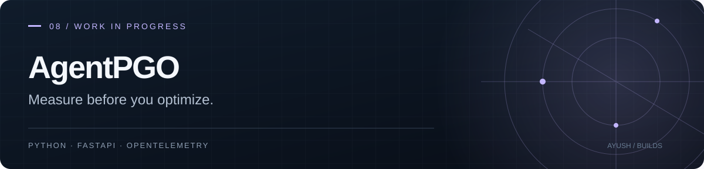

# AgentPGO
### Profile-guided optimization for AI agents.

A backend project for collecting agent traces, profiling cost and latency, evaluating runs, and comparing optimization candidates before exporting recommendations.

**Python · FastAPI · SQLAlchemy · OpenTelemetry · TypeScript SDK**

**Status:** development in progress on the default `backend-v1` branch. The repository contains backend services, SDKs, infrastructure, tests, and a separate landing page. A public backend deployment has not been verified.

## Inside the system

| Area | Source |
| --- | --- |
| API, authentication, and trace ingestion | [apps/api/](apps/api/) |
| Python and TypeScript connectors | [packages/](packages/) |
| Profiling, evaluation, and optimization | [services/](services/) |
| Command-line interface | [cli/](cli/) |
| Database migrations | [migrations/](migrations/) |
| Infrastructure definitions | [infra/terraform/](infra/terraform/) |
| Architecture notes | [docs/backend-architecture.md](docs/backend-architecture.md) |

The API accepts OTLP JSON at `/v1/traces` and `/v1/otlp/v1/traces`. Protected operations require tenant-scoped credentials. Connector instrumentation is metadata-only by default and fails open if export is unavailable.

## Local development

Use Python 3.11+:

```sh
git clone --branch backend-v1 https://github.com/AyushKJha/PCO_work.git
cd PCO_work
python -m venv .venv
```

Activate the environment (`.venv\Scripts\Activate.ps1` on Windows or `source .venv/bin/activate` on macOS/Linux), then install:

```sh
python -m pip install -e ".[dev]"
python -m pytest -q
uvicorn apps.api.main:app --reload
```

Read the [backend architecture](docs/backend-architecture.md), [migration notes](migrations/README.md), and [Python SDK guide](packages/sdk-py/README.md) for configuration and integration. Starting the server alone does not provision a hosted service or production database.

## Evaluation boundaries

Benchmark replay uses historical reports and is a proxy measurement. It should not be presented as a new live provider benchmark or a measured production improvement. Live provider runs require separate credentials and recorded usage/latency evidence.

The codebase includes billing and deployment components; their presence does not establish that a production service or payment integration is live.

[Development and benchmark notes](DEVELOPMENT.md) · [Local AWS validation](docs/aws/local-validation.md)
