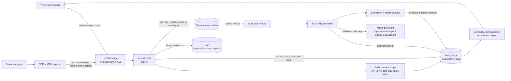
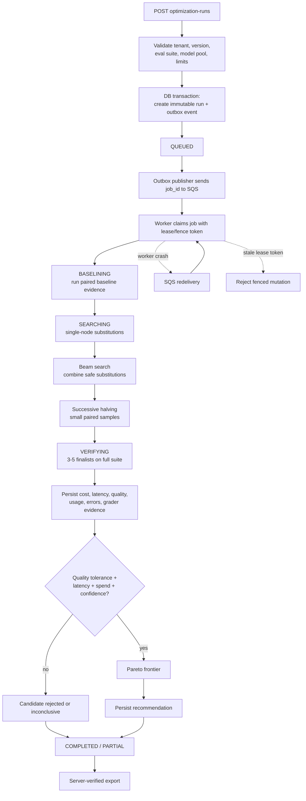
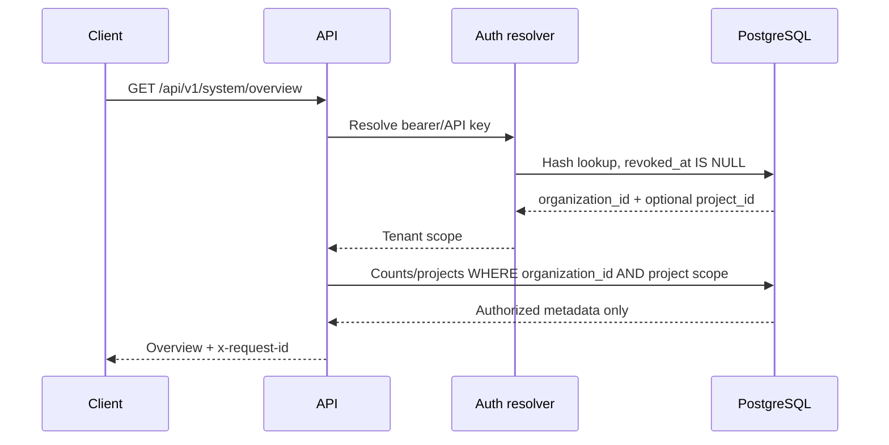

# AgentPGO backend architecture

This document describes the B2B V1 control plane that powers TwineRun. The
browser talks to the versioned FastAPI API; it does not execute optimization
work and it never receives provider credentials. Customer production agents
remain independent of the optimizer: they emit metadata-only OpenTelemetry
spans and continue operating if AgentPGO is unavailable.

## Request and data flow

## Optimization execution graph

Every long-running operation is durable. PostgreSQL owns the state machine and
SQS only delivers a small `job_id`; the message does not contain the full
workload. A worker can therefore be restarted and resume from the last
checkpoint without trusting process memory.

## Tenant authorization boundary

The bearer token or API key is resolved before project data is read. Every
project-scoped query includes both `organization_id` and the key's optional
`project_id`. A project key cannot create projects or read another project's
traces, cases, events, candidates, layouts, or exports.

## Failure boundaries

- A provider timeout is classified and retried only within bounded worker
  policy; evaluation fallback models are not silently substituted.
- A worker crash causes SQS redelivery. Execution receipts and candidate/case
  uniqueness prevent normal duplicate provider calls; exactly-once external
  execution is not claimed where a provider lacks idempotency keys.
- A failed readiness dependency prevents traffic or work acceptance; liveness
  remains a process check.
- Prompt/output bodies are not collected by default. Content retention is an
  explicit project policy and must be redacted, encrypted, and retained for a
  bounded period.
- Browser state is never authoritative for metrics or exports. Candidates and
  recommendations are reconstructed from persisted evaluation evidence.
